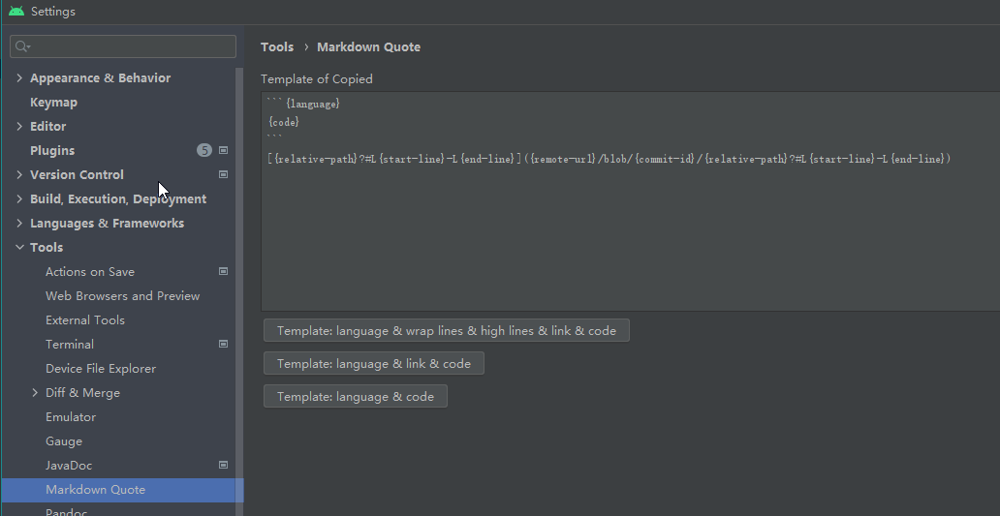
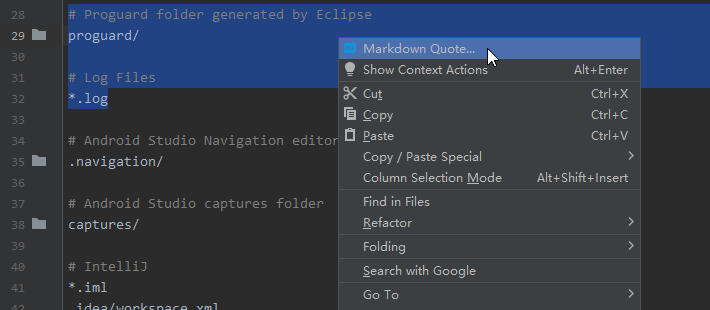
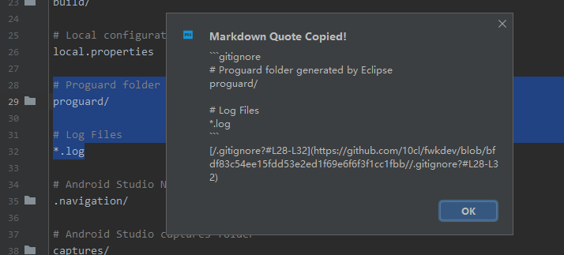

# MarkdownQuote

Right-click and choose "Markdown Quote...", then get the code block as you want.

You can change the template as you like.

## How to Use?


- Settings(Choose Template)  


- Choose Code snippet  


- Copied


## Copy Template

- Template: language & link & code  
````markdown
```java
        // Use current adjustment when freezing, set adjustment when unfreezing.
        if (state.getCurAdj() >= ProcessList.CACHED_APP_MIN_ADJ && !opt.isFrozen()
                && !opt.shouldNotFreeze()) {
            mCachedAppOptimizer.freezeAppAsyncLSP(app);
        } else if (state.getSetAdj() < ProcessList.CACHED_APP_MIN_ADJ) {
            mCachedAppOptimizer.unfreezeAppLSP(app, oomAdjReason);
        }
    }
```
[OomAdjuster.java#3125-L3131](https://github.com/10cl/fwkdev/blob/android-13.0.0_r52/dev/src/frameworks/base/services/core/java/com/android/server/am/OomAdjuster.java#3125-L3131)
````

- Template: language & wrap lines & high lines & link & code  
````markdown
```java {3125-3131} (https://github.com/10cl/fwkdev/blob/android-13.0.0_r52/dev/src/frameworks/base/services/core/java/com/android/server/am/OomAdjuster.java#3125-L3131)
        // Use current adjustment when freezing, set adjustment when unfreezing.
        if (state.getCurAdj() >= ProcessList.CACHED_APP_MIN_ADJ && !opt.isFrozen()
                && !opt.shouldNotFreeze()) {
            mCachedAppOptimizer.freezeAppAsyncLSP(app);
        } else if (state.getSetAdj() < ProcessList.CACHED_APP_MIN_ADJ) {
            mCachedAppOptimizer.unfreezeAppLSP(app, oomAdjReason);
        }
    }
```
````

- Template: language & code  
````markdown
```java
        // Use current adjustment when freezing, set adjustment when unfreezing.
        if (state.getCurAdj() >= ProcessList.CACHED_APP_MIN_ADJ && !opt.isFrozen()
                && !opt.shouldNotFreeze()) {
            mCachedAppOptimizer.freezeAppAsyncLSP(app);
        } else if (state.getSetAdj() < ProcessList.CACHED_APP_MIN_ADJ) {
            mCachedAppOptimizer.unfreezeAppLSP(app, oomAdjReason);
        }
    }
```
````